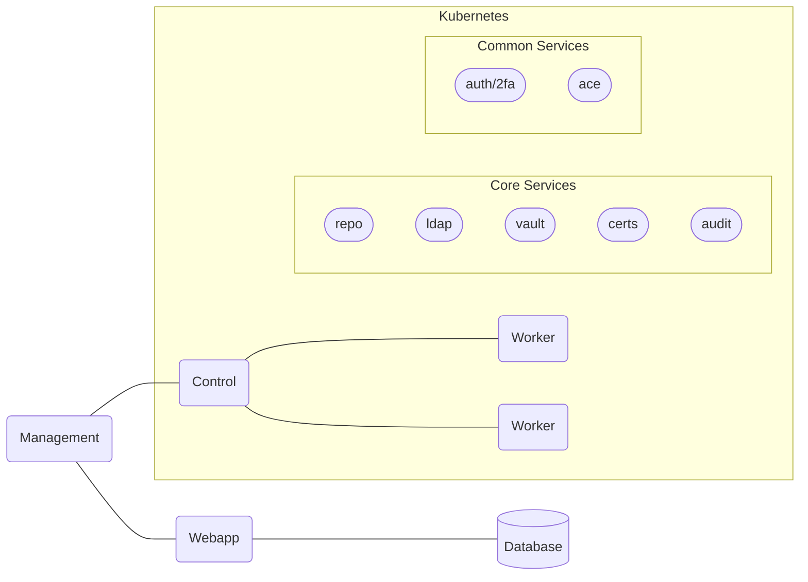

# Architecture

```mermaid
flowchart LR
mgmt("Management")
app("Webapp")
db[("Database")]
subgraph "Kubernetes"
    master(Control)
    worker1(Worker)
    worker2(Worker)
    master---worker1
    master---worker2
    subgraph "Core Services"
       repo([repo])
       ldap([ldap])
       vault([vault])
       certs([certs])
       audit([audit])
    end
    subgraph "Common Services"
       auth([auth/2fa])
       ace([ace])
       auth([auth/2fa])
    end
end

mgmt---app
mgmt---master
app---db
```