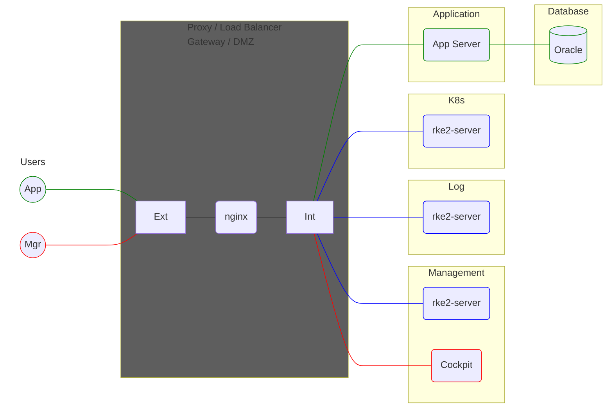
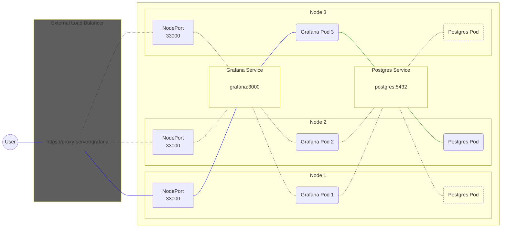

## 4-1 Architecture
### Virtual Machines

## Functional Components

### External Load Balancer
The external load balancer is how end users access internal applications and services. It is the sole entrypoint to the system and isolates the internal network from the external. It provides SSL termination, exposes UIs to end users as well as APIs to browsers and external integration services.

### Application Server
The application server runs web applications in servlet containers.

### Database
The database provides persistence for web applications and container services. 

### Kubernetes Cluster
The kubernetes cluster consists of three control-plane/worker nodes and provides access to container workloads

