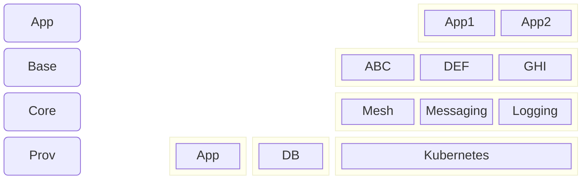

# Build Pipelines

```mermaid
block-beta
columns 7

    appr1c1("App") 
    space:4 
    block:appr1c5:2
        App1 
        App2
    end

    baser2c1("Base") 
    space:3
    block:baser2c4:3
        ABC DEF GHI
    end

    corer3c1("Core") 
    space:3
    block:corer3c4:3
        Mesh Messaging Logging
    end

    provr4c1("Prov") 
    space:1
    block:provr4c2:1
        App
    end
    block:provr4c3:1
        DB
    end
    block:provr3c4:3
        Kubernetes
    end
```